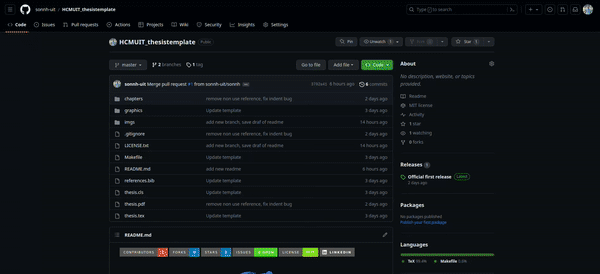

<!-- PROJECT LOGO -->
<br />
<div align="center">
  <a href="https://github.com/Junkohoutarou/Latex_Source.git">
    
  </a>

<h3 align="center">HCMUIT Thesis Template</h3>
  </p>
  <p align="center">
    <!-- <a href="https://github.com/Junkohoutarou/Latex_Source.git"><strong>Explore the docs »</strong></a> -->
    <!-- <br /> -->
    A small project to writing UIT thesis correctly.
    <br />
    <a href="https://github.com/Junkohoutarou/Latex_Source/tree/master/imgs/demo">View Demo</a>
    ·
    <a href="https://github.com/Junkohoutarou/Latex_Source/issues">Report Bug</a>
    ·
  </p>
</div>


<!-- ABOUT THE PROJECT -->
## About The Project
This is non profit project. When I was a student, I atended  graduation thesis with a lot of worries, the most worried was not completing it. But then, under the encouragement of the lecturer, I also defend successfully with a modest score: 8.3. Research and develop are hard. But present it properly, synchronously and beautifully are more difficult than, especially with group. 

At that time, my group didn't know Latex. We use Google Doc and Microsoft Word to write thesis. Using these is quick and convenient, but encounteres some problem:
- Our thesis has to write many math formulas. Write by Google Doc is impossible, MS Word is hard, take time and easy to get the wrong format when copy.
- Do not synchronize the format of the whole thesis. Chapter 1 with font size 13, chapter 2 with font size 14. Title, caption, number list are all messed up.
- Citations is very difficult and time consuming. 

After that, I study master and must be write Latex. I discovered new horizons. Many younger student who do thesis, asked me how written thesis, I sent them my old pdf thesis. However, many of you do not know how to do it. I feel that Word is much more difficult to use than Latex, although it has a friendly interface.

In my spare time, I have researched and learned the Latex source of thesis from a friend from BKU. Since then, I have customized it to suit the requirements of the UIT. You guys can use it as a standard template to write, without having to worry about how to format it anymore.
### Built With
[![Latex][Latex]][Latex-url]
<!-- GETTING STARTED -->
## Getting Started
This is guideline how you setting up your thesis. Follow the instruction bellow.

### Prerequisites

- If you use `Overleaf`, you just register an account.
- If you want to build from this source, you must have unix system such as Ubuntu, CentOS, RHEL, Amazon Linux whose installed `Makefile`. To install that, follow the instruction of your OS. The example bellow is in Ubuntu 22 LTS
  ```
  sudo apt install make
  ```
- If you use docker, [INSTALL DOCKER](https://docs.docker.com/engine/install/) in their website.

### Installation

#### Overleaf
1. Download lastest source code from [Project Releas](https://github.com/Junkohoutarou/Latex_Source/releases) 
2. Login to your project at https://www.overleaf.com/project
3. On the left side, choose `New Project` button and select `Upload Project`.
4. On the pop up, select a zip file you already download before.
5. Your project will automatically open.

or 

- [Get template in Overleaf](https://www.overleaf.com/latex/templates/hcmuit-thesistemplate/ghqpckjqdxfz) to your project.
#### Building from source
##### Buid from local machine Ubuntu
1. Clone project from github
    ```
    git clone https://github.com/Junkohoutarou/Latex_Source.git
    ```
2. Cd to project
    ```
    cd HCMUIT_thesis_template
    ```
3. Install require package
    ```
    make
    ```
4. Building example project
    ```
    make build
    ```
##### Buid from docker
1. Clone project from github
    ```
    git clone https://github.com/Junkohoutarou/Latex_Source.git
    ```
2. Cd to project
    ```
    cd Latex_Source
    ```
3. Build with docker-compose
    ```
    sudo docker-compose up
    ```

<!-- USAGE EXAMPLES -->
<!-- ## Usage -->

## DEMO
- The gifs bellow display step by step to use this project in Overleaf
<!-- ### Overleaf -->



- To change your name and your thesis title. Change the information in `thesis.tex` (from line 35 to line 50). 
- To add more references, after adding file to the references folder, add more line in `thesis.tex` 's config reference session (from line 25 to line 27). 
<!-- CONTRIBUTING -->
## Contributing

If you have a suggestion that would make this better, please fork the repo and create a pull request. You can also simply open an issue with the tag "enhancement".
Don't forget to give the project a star! Thanks again!

1. Fork the Project
2. Create your Feature Branch (`git checkout -b feature/AmazingFeature`)
3. Commit your Changes (`git commit -m 'Add some AmazingFeature'`)
4. Push to the Branch (`git push origin feature/AmazingFeature`)
5. Open a Pull Request


<!-- LICENSE -->
## License

Distributed under the MIT License. See `LICENSE.txt` for more information.


<!-- ACKNOWLEDGMENTS -->
<!-- ## Acknowledgments

* []()
* []()
* []() -->


[download-shield]: https://img.shields.io/github/downloads/sonnh-uit/HCMUIT_thesistemplate/total.svg?style=for-the-badge
[download-url]: https://github.com/sonnh-uit/HCMUIT_thesistemplate

[Latex]: https://img.shields.io/badge/Latex-000000?style=for-the-badge&logo=latex&logoColor=white
[Latex-url]: https://www.latex-project.org/
